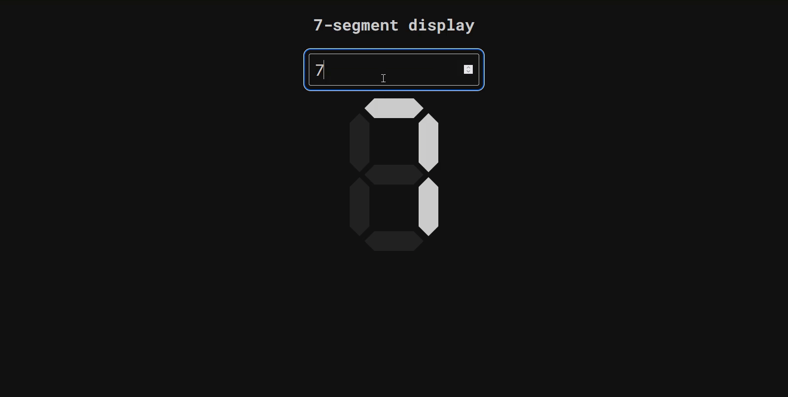

# html-css-segment-display

7-segment display using HTML and CSS

Although, segments are fired with pure CSS selectors
, this project needs [`dynamic-value.js`](./dynamic-value.js) to function properly.

There is no way to update `value` attribute dynamically without JS.

